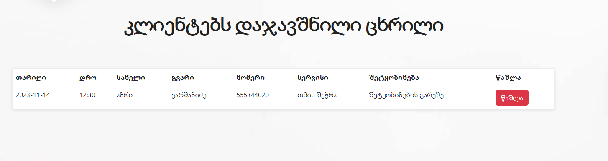

# about project 
# 

## they can find portfolio
## 

## about Customers
### Customer can find services 
### 

### They can order service and day from here
### 

## about Students
### they have also services there
### 

### and they can order too
### 

## Admin
### Admin can see reserved days
### 
### 

## services
### admin can create, edit or delete services and can create another place for other services
### customer services
### 
### student services
### 

### create and see portfolio here
### 

